---
## Front matter
lang: ru-RU
title: Внешний курс. Часть 1
subtitle: Основы кибербезопасности
author:
  - Аджигалиева Амина Руслановна
institute:
  - Российский университет дружбы народов, Москва, Россия
date: 11 мая 2026

## i18n babel
babel-lang: russian
babel-otherlangs: english

## Formatting pdf
toc: false
toc-title: Содержание
slide_level: 2
aspectratio: 169
section-titles: true
theme: metropolis
header-includes:
 - \metroset{progressbar=frametitle,sectionpage=progressbar,numbering=fraction}
---

# Цель работы

Изучить основы кибербезопасности: сетевые протоколы, 
веб-безопасность, анонимизацию и защиту беспроводных сетей

# Модели и протоколы передачи данных

## Протокол прикладного уровня

**HTTPS** — протокол прикладного уровня, использующий шифрование для безопасной передачи данных

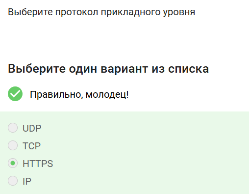{#fig:001 width=40%}

## Транспортный уровень TCP

**TCP** работает на транспортном уровне, обеспечивая надёжную доставку данных

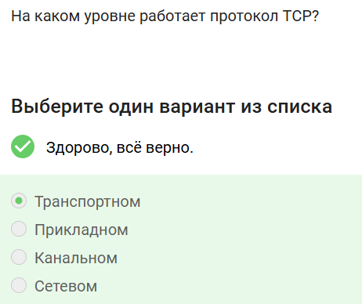{#fig:002 width=40%}

## Корректные IPv4-адреса

**90.11.90.22** и **25.198.0.15** — корректные адреса (октеты от 0 до 255)

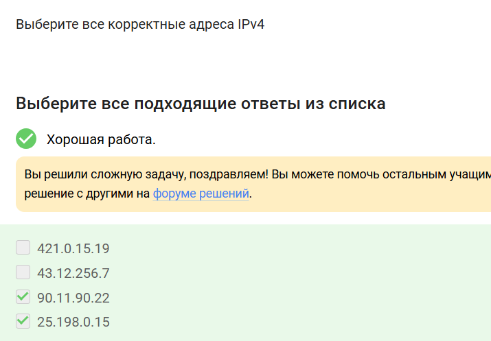{#fig:003 width=40%}

## DNS-сервер

**DNS** сопоставляет IP-адреса доменным именам

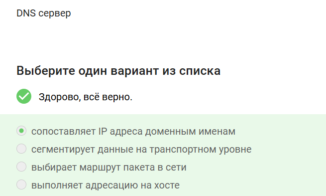{#fig:004 width=40%}

## Модель TCP/IP

Правильная последовательность: **прикладной → транспортный → сетевой → канальный**

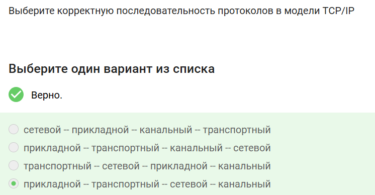{#fig:005 width=40%}

# Веб-безопасность: HTTP и HTTPS

## Протокол HTTP

HTTP передаёт данные между клиентом и сервером **в открытом виде**

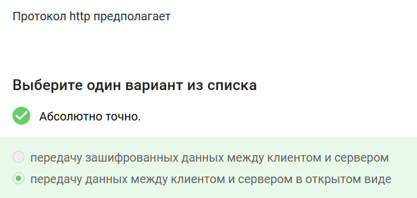{#fig:006 width=40%}

## Фазы HTTPS

HTTPS состоит из двух фаз: **рукопожатия** и **передачи данных**

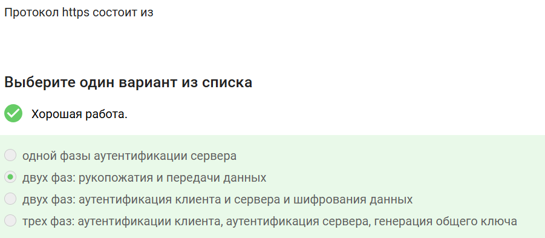{#fig:007 width=40%}

## Генерация сессионного ключа

Общий ключ генерируется **и клиентом, и сервером** в процессе переговоров

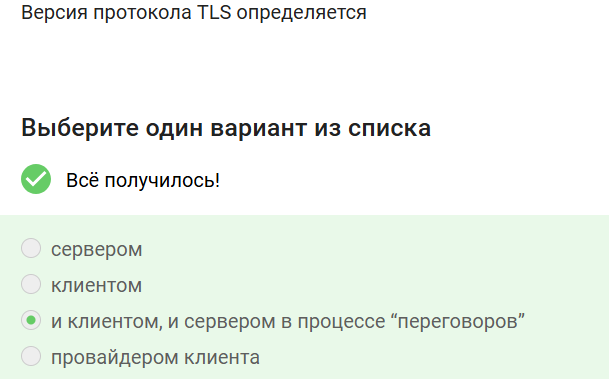{#fig:008 width=40%}

## TLS-рукопожатие

В фазе рукопожатия TLS **не предусмотрено** шифрование данных

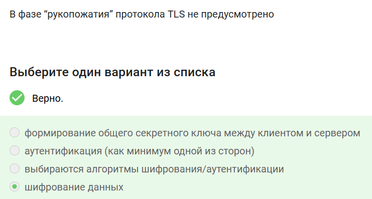{#fig:009 width=40%}

# Куки и отслеживание

## Что хранят куки

Куки хранят **идентификатор пользователя** и **id сессии**

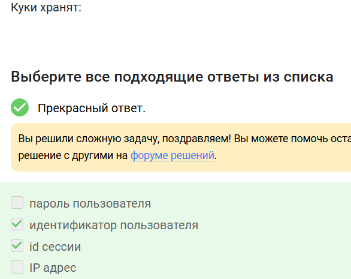{#fig:010 width=40%}

## Для чего НЕ используются куки

Куки **не используются** для улучшения надёжности соединения

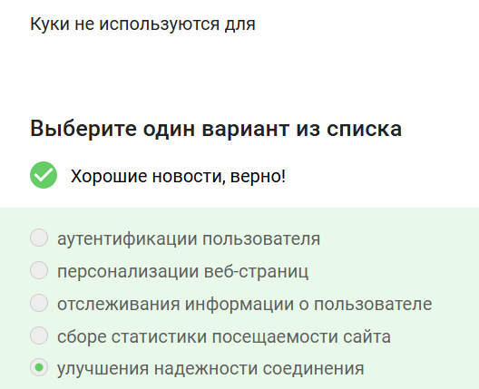{#fig:011 width=40%}

## Кто генерирует куки

Куки генерируются **сервером** (заголовок Set-Cookie)

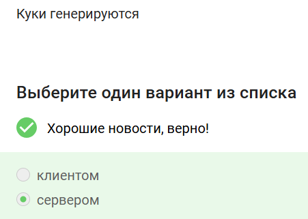{#fig:012 width=40%}

# Анонимизация: сеть Tor

## Кому известен IP-адрес получателя

IP-адрес получателя известен **отправителю** и **выходному узлу**

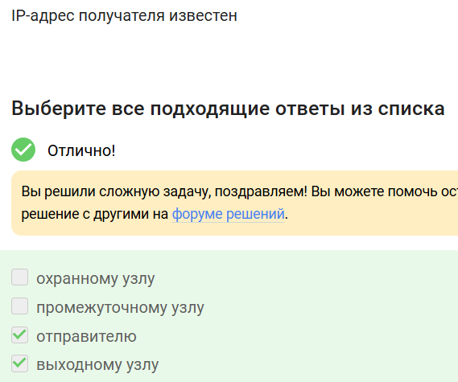{#fig:015 width=40%}

## Общий секретный ключ

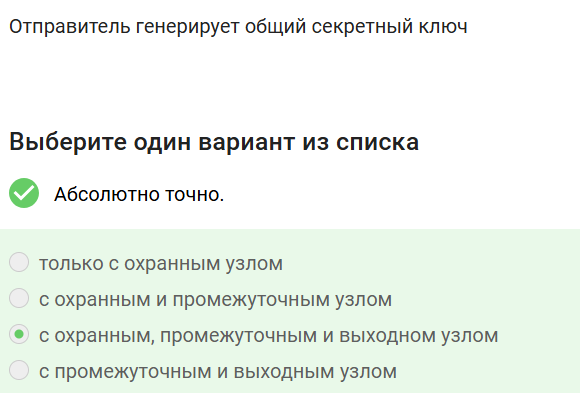{#fig:016 width=40%}

## Tor у получателя

Получатель **не обязан** использовать Tor для получения пакетов

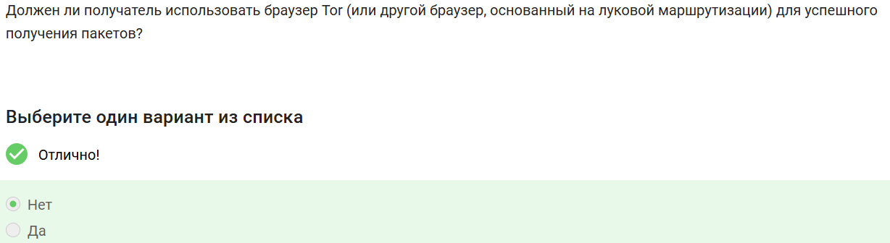{#fig:017 width=40%}

# Беспроводные сети: Wi-Fi

## Что такое Wi-Fi

Технология беспроводной локальной сети по стандарту **IEEE 802.11**

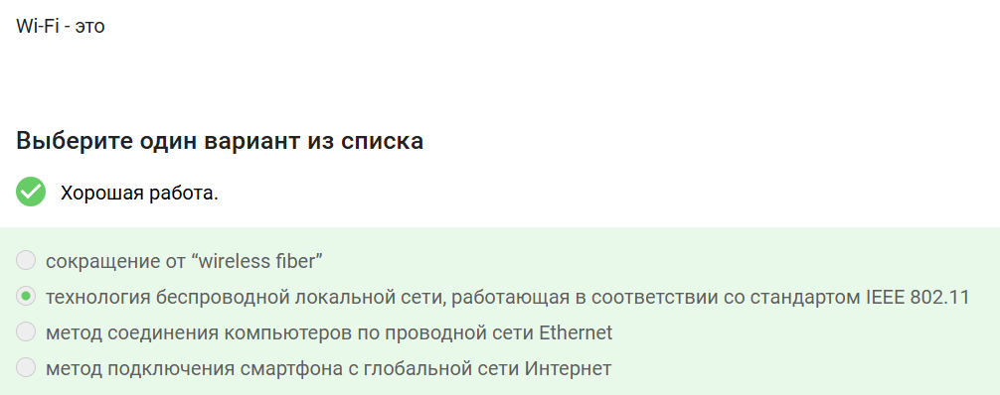{#fig:018 width=40%}

## Уровень работы Wi-Fi

Протокол Wi-Fi работает на **канальном** уровне

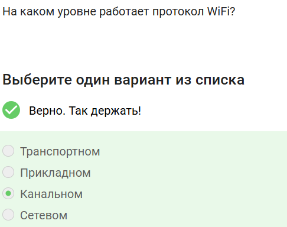{#fig:019 width=40%}

## Небезопасный метод шифрования

**WEP** — устаревший и небезопасный протокол шифрования Wi-Fi

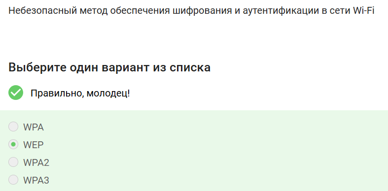{#fig:020 width=40%}

## Передача данных хост-роутер

Данные передаются **в зашифрованном виде после аутентификации**

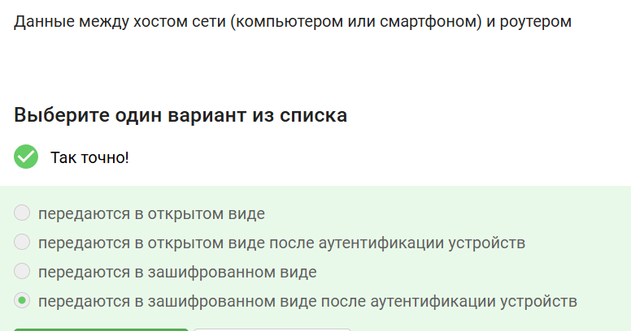{#fig:021 width=40%}

## Аутентификация в домашней сети

Обычно используется метод **WPA2 Personal** (общий пароль PSK)

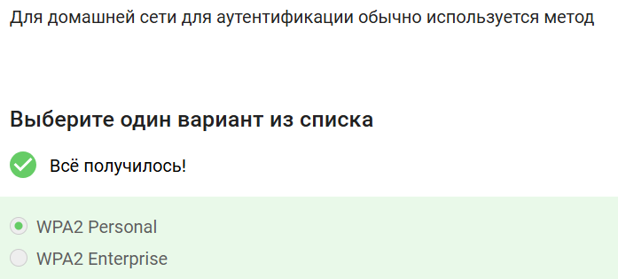{#fig:022 width=40%}

# Итоги курса

## Результаты обучения

- Изучены протоколы TCP/IP, HTTP/HTTPS, TLS
- Освоены механизмы веб-безопасности (куки)
- Рассмотрена анонимизация через сеть Tor
- Изучена защита беспроводных сетей Wi-Fi
