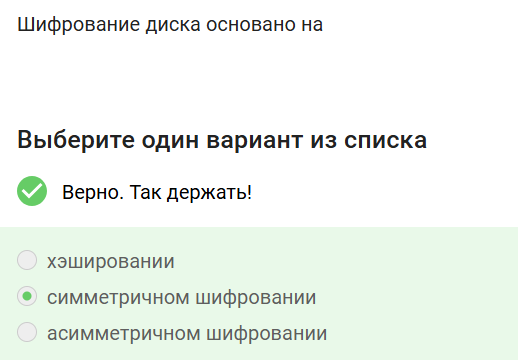
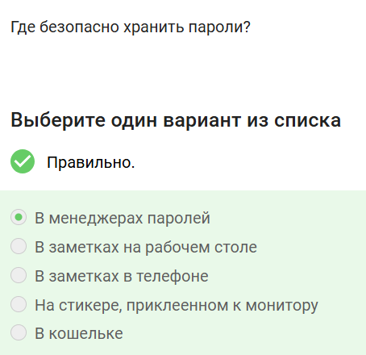
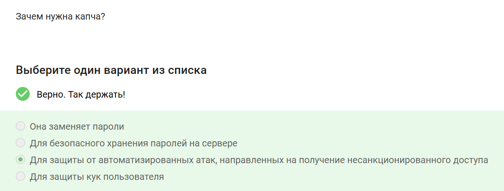
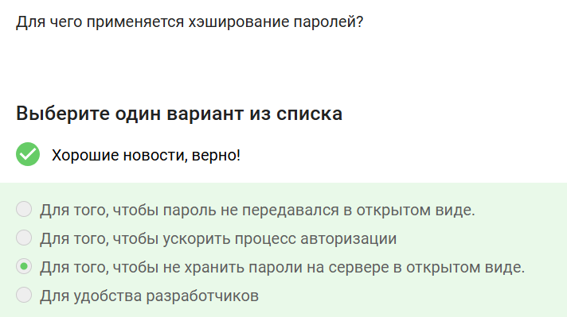
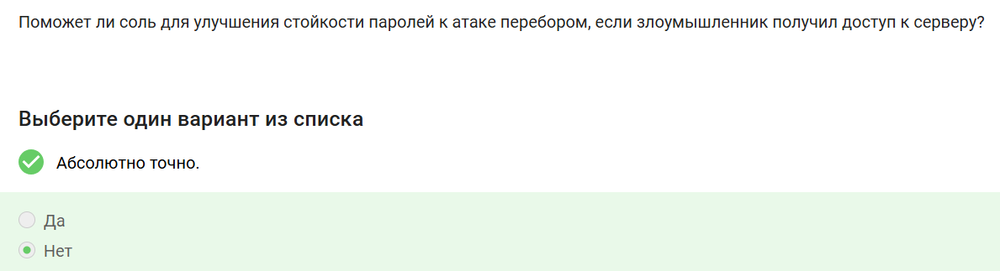
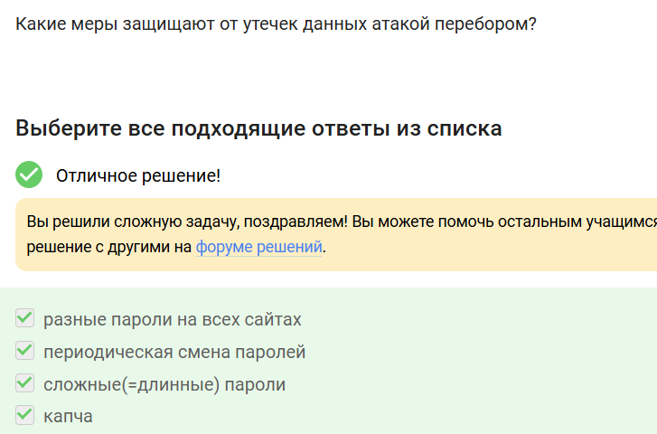
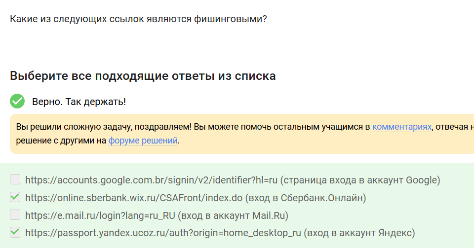
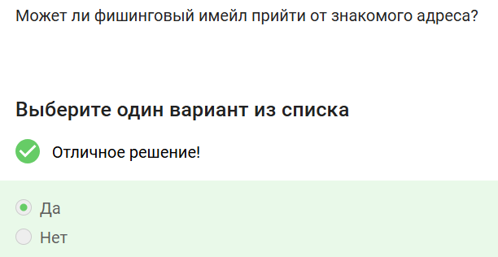
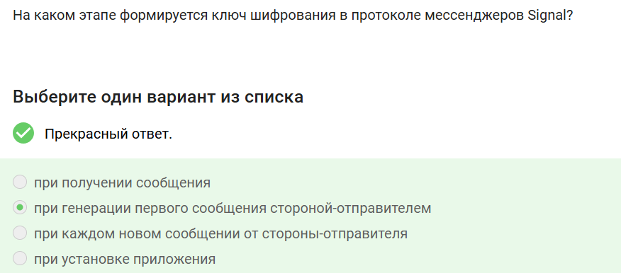
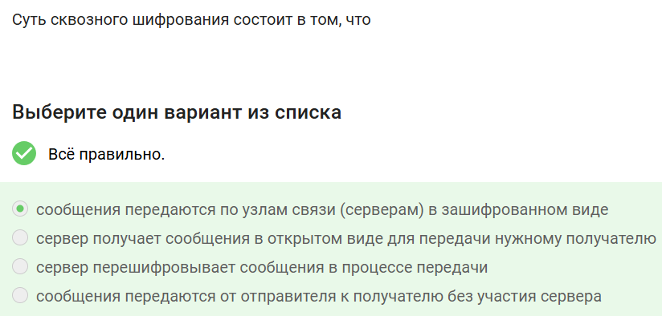

---
## Front matter
lang: ru-RU
title: Внешний курс. Часть 2
subtitle: Основы кибербезопасности
author:
  - Аджигалиева Амина Руслановна
institute:
  - Российский университет дружбы народов, Москва, Россия
date: 11 мая 2026

## i18n babel
babel-lang: russian
babel-otherlangs: english

## Formatting pdf
toc: false
toc-title: Содержание
slide_level: 2
aspectratio: 169
section-titles: true
theme: metropolis
header-includes:
 - \metroset{progressbar=frametitle,sectionpage=progressbar,numbering=fraction}
---

# Цель работы

Изучить методы шифрования данных, парольную защиту, 
противодействие фишингу и сквозное шифрование

# Шифрование данных

## Загрузочный сектор

Загрузочный сектор диска **можно** зашифровать 

{#fig:001 width=40%}

## Основа шифрования диска

Полное шифрование диска основано на **симметричном шифровании** (единый ключ, например AES)

{#fig:002 width=40%}

## Программы шифрования

**BitLocker** и **VeraCrypt** — программы для полного шифрования жёсткого диска

{#fig:003 width=40%}

# Парольная защита

## Стойкие пароли

**UQr9@j4!$$** — стойкий пароль: разный регистр, цифры, спецсимволы, случайный набор

{#fig:004 width=40%}

## Хранение паролей

Пароли безопасно хранить в **менеджерах паролей** (Bitwarden, KeePass)

{#fig:005 width=40%}

## Капча

Капча защищает от **автоматизированных атак** для получения несанкционированного доступа

{#fig:006 width=40%}

## Хэширование паролей

Чтобы **не хранить пароли на сервере в открытом виде** — хранится только хэш

{#fig:007 width=40%}

## Соль и атака перебором

Соль **не поможет**, если злоумышленник получил доступ к серверу и базе данных — защищает только от радужных таблиц

{#fig:008 width=40%}

## Защита от перебора

{#fig:009 width=60%}

# Фишинг и вредоносное ПО

## Фишинговые ссылки

Фишинговые ссылки маскируются под настоящие: `sberbank.wix.ru` и `yandex.ucoz.ru` — подозрительные домены

{#fig:010 width=40%}

## Спуфинг писем

Фишинговое письмо **может** прийти от знакомого адреса — это email-спуфинг

{#fig:011 width=40%}

## Email-спуфинг

**Подмена адреса отправителя** в имейлах — заголовок `From` можно подделать

{#fig:012 width=40%}

## Вирус-троян

Троян **маскируется под легитимную программу**, заставляя пользователя запустить вредоносный код

{#fig:013 width=40%}

# Сквозное шифрование

## Ключ в протоколе Signal

Ключ формируется при **генерации первого сообщения стороной-отправителем** (протокол Double Ratchet)

{#fig:014 width=40%}

## Суть сквозного шифрования

Сообщения передаются по узлам связи **в зашифрованном виде** — сервер не может прочитать содержимое

{#fig:015 width=40%}

# Итоги курса

## Результаты обучения

- Изучено шифрование диска (BitLocker, VeraCrypt)
- Освоены принципы создания и хранения стойких паролей
- Рассмотрена защита от фишинга и email-спуфинга
- Изучен принцип сквозного шифрования в мессенджерах
