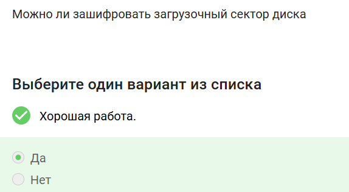
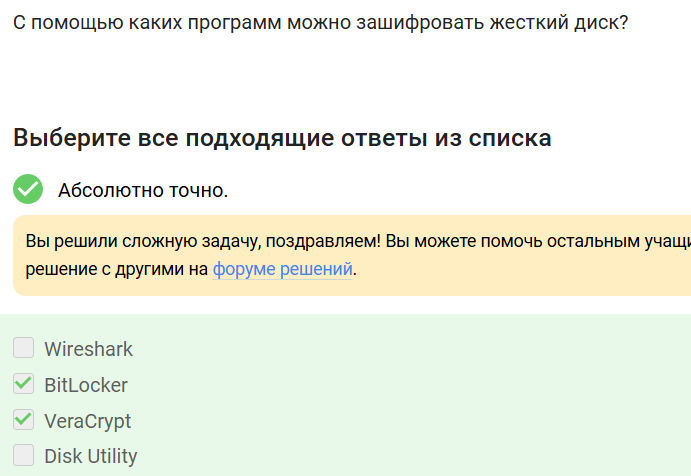
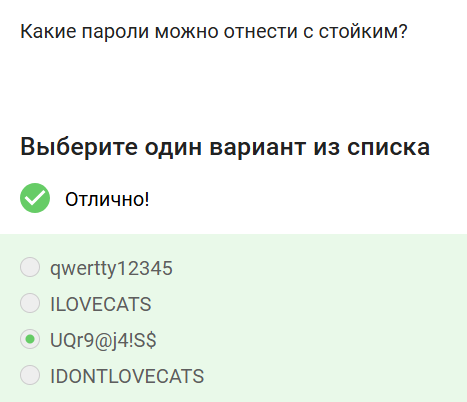
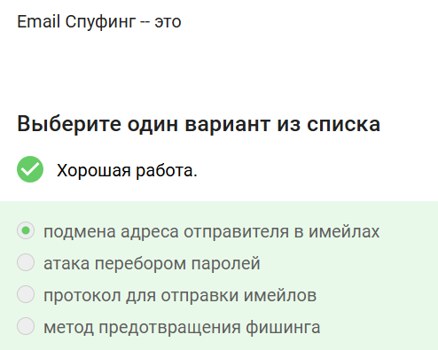
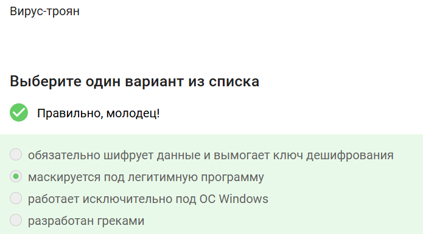

---
## Front matter
title: "Отчёт по прохождению внешнего курса: Основы кибербезопасности"
subtitle: "Часть 2"
author: "Аджигалиева Амина"

## Generic otions
lang: ru-RU
toc-title: "Содержание"

## Bibliography
bibliography: bib/cite.bib
csl: pandoc/csl/gost-r-7-0-5-2008-numeric.csl

## Pdf output format
toc: true # Table of contents
toc-depth: 2
lof: true # List of figures
fontsize: 12pt
linestretch: 1.5
papersize: a4
documentclass: scrreprt
## I18n polyglossia
polyglossia-lang:
  name: russian
  options:
	- spelling=modern
	- babelshorthands=true
polyglossia-otherlangs:
  name: english
## I18n babel
babel-lang: russian
babel-otherlangs: english
## Fonts
mainfont: IBM Plex Serif
romanfont: IBM Plex Serif
sansfont: IBM Plex Sans
monofont: IBM Plex Mono
mathfont: STIX Two Math
mainfontoptions: Ligatures=Common,Ligatures=TeX,Scale=0.94
romanfontoptions: Ligatures=Common,Ligatures=TeX,Scale=0.94
sansfontoptions: Ligatures=Common,Ligatures=TeX,Scale=MatchLowercase,Scale=0.94
monofontoptions: Scale=MatchLowercase,Scale=0.94,FakeStretch=0.9
mathfontoptions:
## Biblatex
biblatex: true
biblio-style: "gost-numeric"
biblatexoptions:
  - parentracker=true
  - backend=biber
  - hyperref=auto
  - language=auto
  - autolang=other*
  - citestyle=gost-numeric
## Pandoc-crossref LaTeX customization
figureTitle: "Рис."
tableTitle: "Таблица"
listingTitle: "Листинг"
lofTitle: "Список иллюстраций"
lolTitle: "Листинги"
## Misc options
indent: true
header-includes:
  - \usepackage{indentfirst}
  - \usepackage{float} # keep figures where there are in the text
  - \floatplacement{figure}{H} # keep figures where there are in the text
---

# Цель работы
Изучить методы шифрования данных, принципы создания и хранения надёжных паролей, а также способы защиты от фишинговых атак и вредоносного ПО.

# Ход выполнения

## Шифрование диска

Можно ли зашифровать загрузочный сектор диска?
Да

{ #fig:001 width=70% }

Шифрование диска основано на симметричном шифровании
При полном шифровании диска данные шифруются и расшифровываются одним и тем же ключом, поэтому используется быстрое симметричное шифрование (например, AES).

{ #fig:002 width=70% }

С помощью каких программ можно зашифровать жесткий диск?
BitLocker (встроен в Windows Pro/Enterprise) и VeraCrypt (бесплатный, с открытым исходным кодом) являются программами для полного шифрования дисков.

{ #fig:003 width=70% }

## Парольная защита

Какие пароли можно отнести к стойким?
Пароль **UQr9@j4!$$** содержит буквы разного регистра, цифры и спецсимволы, что делает его случайным и устойчивым к перебору, в отличие от словарных фраз.

{ #fig:004 width=70% }

Где безопасно хранить пароли?
В менеджерах паролей (Bitwarden, KeePass, 1Password), которые хранят все пароли в зашифрованной базе данных, защищённой мастер-паролем.

{ #fig:005 width=70% }

Зачем нужна капча?
Капча используется для защиты от автоматизированных атак (ботов), которые пытаются получить несанкционированный доступ путём массового подбора паролей или отправки форм.

{ #fig:006 width=70% }

Для чего применяется хэширование паролей?
Чтобы не хранить пароли на сервере в открытом виде. Сервер хранит только хэш, и даже при утечке базы данных злоумышленник не получит исходные пароли напрямую.

{ #fig:007 width=70% }

Поможет ли соль для улучшения стойкости паролей к атаке перебором, если злоумышленник получил доступ к серверу?
Нет. Если злоумышленник украл базу данных вместе с солью и хешами, соль не спасёт от прямого перебора. Она защищает только от радужных таблиц.

{ #fig:008 width=70% }

Какие меры защищают от утечек данных атакой перебором?

{ #fig:009 width=70% }

## Фишинг и вредоносное ПО

Какие из следующих ссылок являются фишинговыми?
Фишинговыми являются ссылки с подозрительными доменами: `online.sberbank.wix.ru` (подделка Сбербанка на бесплатном хостинге) и `passport.yandex.ucoz.ru` (подделка Яндекса на Ucoz).

{ #fig:010 width=70% }

Может ли фишинговый имейл прийти от знакомого адреса?
Да. Это называется спуфинг — злоумышленник подделывает адрес отправителя, чтобы письмо выглядело как отправленное знакомым или доверенной организацией.

{ #fig:011 width=70% }

Email Спуфинг – это подмена адреса отправителя в имейлах
Технически заголовок `From` в SMTP-протоколе можно подделать, так как базовая аутентификация отправителя не является обязательной.

{ #fig:012 width=70% }

Вирус-троян маскируется под легитимную программу
Троян (троянский конь) получил своё название за способ проникновения — он притворяется полезным ПО (игрой, утилитой, документом), чтобы заставить пользователя запустить вредоносный код.

{ #fig:013 width=70% }

## Сквозное шифрование

На каком этапе формируется ключ шифрования в протоколе мессенджеров Signal?
При генерации первого сообщения стороной-отправителем. В Signal используется протокол Double Ratchet, где начальный ключ создаётся при первом взаимодействии.

{ #fig:014 width=70% }

Суть сквозного шифрования состоит в том, что сообщения передаются по узлам связи в зашифрованном виде
При сквозном (end-to-end) шифровании сервер выступает лишь транспортом и не может прочитать содержимое сообщений, так как ключи хранятся только на устройствах участников.

{ #fig:015 width=70% }

# Заключение
В ходе второй части курса были изучены принципы шифрования данных, основы создания стойких паролей и их безопасного хранения, методы защиты от фишинга и вредоносного ПО, а также технология сквозного шифрования в мессенджерах.
