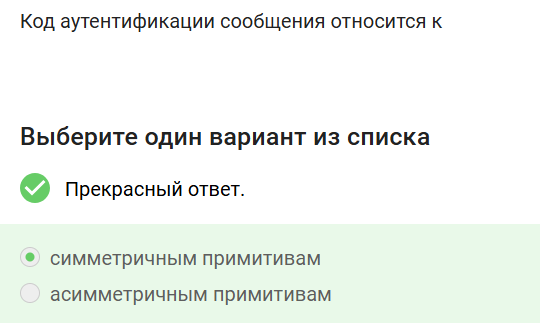
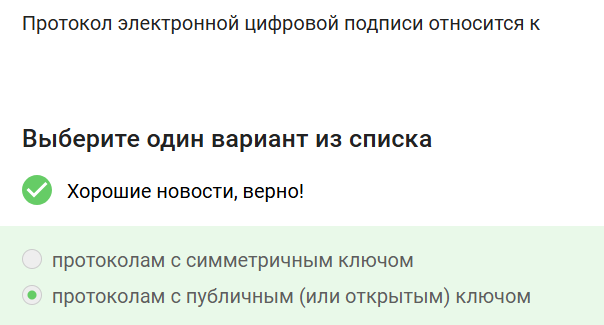
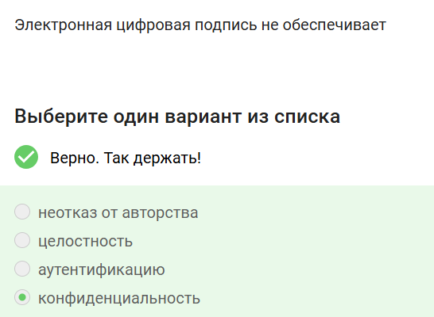
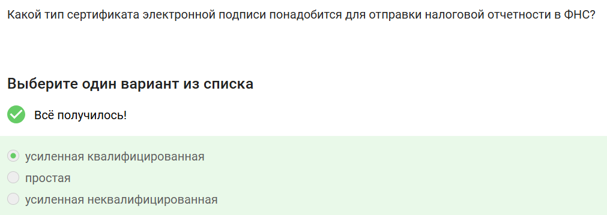
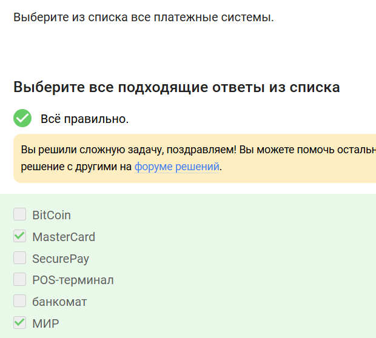
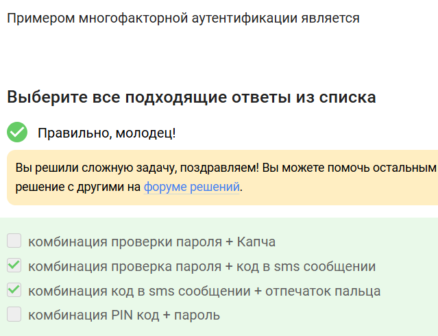
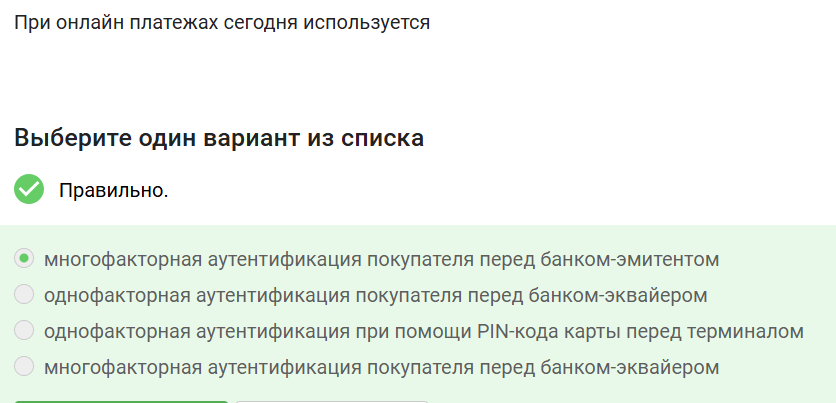
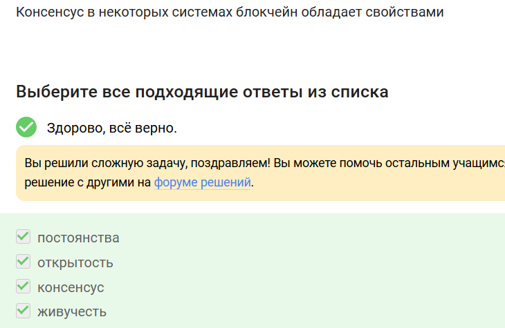
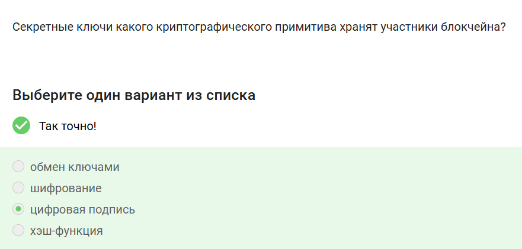

---
## Front matter
lang: ru-RU
title: Внешний курс. Часть 3
subtitle: Основы кибербезопасности
author:
  - Аджигалиева Амина Руслановна
institute:
  - Российский университет дружбы народов, Москва, Россия
date: 11 мая 2026

## i18n babel
babel-lang: russian
babel-otherlangs: english

## Formatting pdf
toc: false
toc-title: Содержание
slide_level: 2
aspectratio: 169
section-titles: true
theme: metropolis
header-includes:
 - \metroset{progressbar=frametitle,sectionpage=progressbar,numbering=fraction}
---

# Цель работы

Изучить криптографические примитивы, электронную подпись, 
многофакторную аутентификацию и технологию блокчейн

# Криптографические примитивы

## Асимметричная криптография

В асимметричных примитивах **обе стороны имеют пару ключей** (открытый и секретный)

{#fig:001 width=40%}

## Хэш-функция

{#fig:002 width=40%}

## Алгоритмы ЭЦП

Цифровая подпись: **RSA**, **ECDSA**, **ГОСТ Р 34.10-2012**
(AES — шифрование, SHA2 — хэш)

{#fig:003 width=40%}

## Код аутентификации (MAC)

MAC относится к **симметричным** примитивам (единый секретный ключ)

{#fig:004 width=40%}

## Диффи-Хэллман

**Асимметричный** примитив генерации общего **секретного** ключа

{#fig:005 width=40%}

# Электронная цифровая подпись

## Класс протокола

ЭЦП относится к протоколам с **публичным (открытым) ключом**

{#fig:006 width=40%}

## Верификация подписи

На вход: **подпись + открытый ключ + сообщение**

{#fig:007 width=40%}

## Свойства ЭЦП

ЭЦП **не обеспечивает** конфиденциальность (только целостность, аутентификацию, неотказ)

{#fig:008 width=40%}

# Сертификаты и платёжные системы

## Сертификат для ФНС

**Усиленная квалифицированная** электронная подпись

{#fig:009 width=40%}

## Где получить сертификат

В **удостоверяющем (сертификационном) центре**

{#fig:010 width=40%}

## Платёжные системы

**MasterCard** и **МИР** — платёжные системы
(BitCoin — криптовалюта, терминал и банкомат — устройства)

{#fig:011 width=40%}

# Многофакторная аутентификация и блокчейн

## Многофакторная аутентификация

Примеры: **пароль + SMS** (знание + владение), **SMS + отпечаток** (владение + свойство)

{#fig:012 width=40%}

## Онлайн-платежи

Многофакторная аутентификация покупателя перед **банком-эмитентом** (3D Secure)

{#fig:013 width=40%}

## Доказательство работы (PoW)

Свойство хэш-функции: **сложность нахождения прообраза**

{#fig:014 width=40%}

## Свойства консенсуса

**Постоянство**, **открытость**, **живучесть**, **консенсус**

{#fig:015 width=40%}

## Ключи в блокчейне

Участники хранят секретные ключи **цифровой подписи** для авторизации транзакций

{#fig:016 width=40%}

# Итоги курса

## Результаты обучения

- Изучены асимметричные и симметричные криптопримитивы
- Освоены принципы ЭЦП и её верификации
- Рассмотрены сертификаты и платёжные системы
- Изучена многофакторная аутентификация
- Разобраны основы технологии блокчейн
