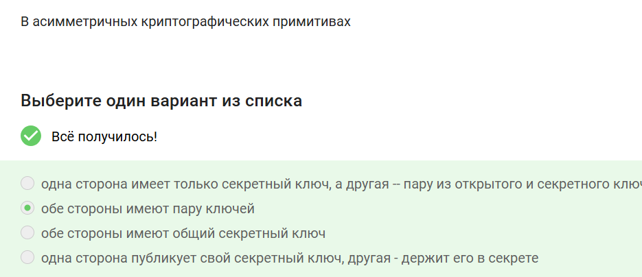
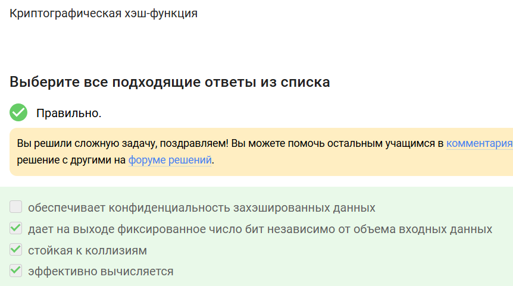
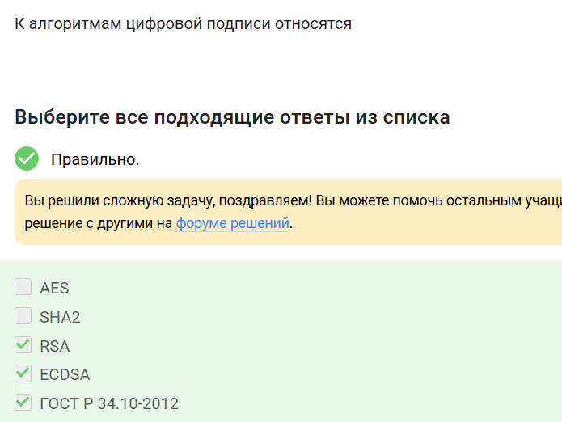
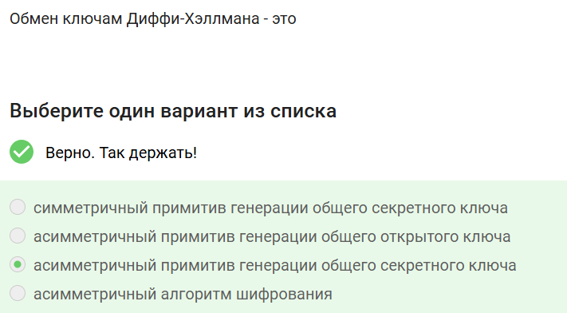
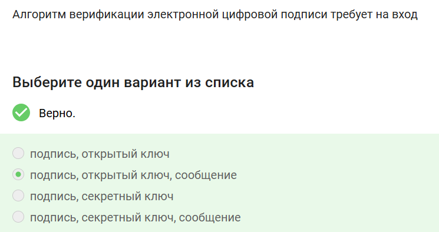
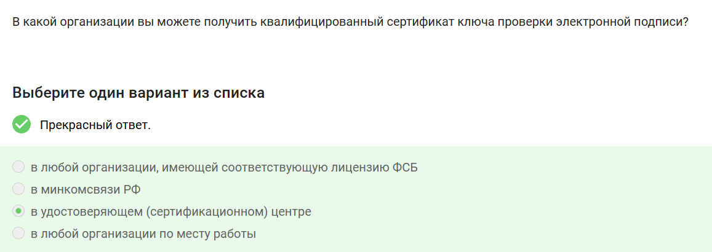
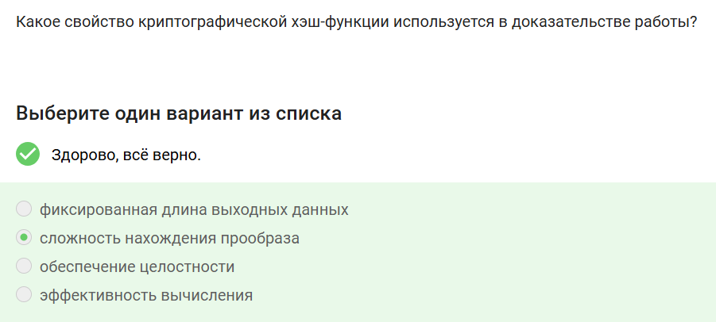

---
## Front matter
title: "Отчёт по прохождению внешнего курса: Основы кибербезопасности"
subtitle: "Часть 3"
author: "Аджигалиева Амина"

## Generic otions
lang: ru-RU
toc-title: "Содержание"

## Bibliography
bibliography: bib/cite.bib
csl: pandoc/csl/gost-r-7-0-5-2008-numeric.csl

## Pdf output format
toc: true # Table of contents
toc-depth: 2
lof: true # List of figures
fontsize: 12pt
linestretch: 1.5
papersize: a4
documentclass: scrreprt
## I18n polyglossia
polyglossia-lang:
  name: russian
  options:
	- spelling=modern
	- babelshorthands=true
polyglossia-otherlangs:
  name: english
## I18n babel
babel-lang: russian
babel-otherlangs: english
## Fonts
mainfont: IBM Plex Serif
romanfont: IBM Plex Serif
sansfont: IBM Plex Sans
monofont: IBM Plex Mono
mathfont: STIX Two Math
mainfontoptions: Ligatures=Common,Ligatures=TeX,Scale=0.94
romanfontoptions: Ligatures=Common,Ligatures=TeX,Scale=0.94
sansfontoptions: Ligatures=Common,Ligatures=TeX,Scale=MatchLowercase,Scale=0.94
monofontoptions: Scale=MatchLowercase,Scale=0.94,FakeStretch=0.9
mathfontoptions:
## Biblatex
biblatex: true
biblio-style: "gost-numeric"
biblatexoptions:
  - parentracker=true
  - backend=biber
  - hyperref=auto
  - language=auto
  - autolang=other*
  - citestyle=gost-numeric
## Pandoc-crossref LaTeX customization
figureTitle: "Рис."
tableTitle: "Таблица"
listingTitle: "Листинг"
lofTitle: "Список иллюстраций"
lolTitle: "Листинги"
## Misc options
indent: true
header-includes:
  - \usepackage{indentfirst}
  - \usepackage{float} # keep figures where there are in the text
  - \floatplacement{figure}{H} # keep figures where there are in the text
---

# Цель работы
Изучить основы криптографии: асимметричные и симметричные примитивы, хэш-функции, электронную цифровую подпись, многофакторную аутентификацию, а также применение этих технологий в платёжных системах и блокчейне.

# Ход выполнения

## Криптографические примитивы

В асимметричных криптографических примитивах обе стороны имеют пару ключей
В асимметричной криптографии у каждого участника есть открытый ключ (доступен всем) и секретный ключ (хранится в тайне). Это фундаментальное отличие от симметричной криптографии.

{ #fig:001 width=70% }

Криптографическая хэш-функция
Хэш-функция даёт на выходе фиксированное число бит, стойкая к коллизиям и эффективно вычисляется. Конфиденциальность она не обеспечивает, так как необратима.

{ #fig:002 width=70% }

К алгоритмам цифровой подписи относятся RSA, ECDSA и ГОСТ Р 34.10-2012
Данные алгоритмы реализуют математические схемы для создания и проверки электронной подписи. AES — алгоритм шифрования, SHA2 — хэш-функция.

{ #fig:003 width=70% }

## Симметричные и асимметричные примитивы

Код аутентификации сообщения относится к симметричным примитивам
MAC (Message Authentication Code) использует общий секретный ключ для генерации и проверки кода целостности сообщения.

{ #fig:004 width=70% }

Обмен ключами Диффи-Хэллмана — это асимметричный примитив генерации общего секретного ключа
Протокол Диффи-Хэллмана позволяет двум сторонам создать общий секрет через открытый канал связи, используя пары асимметричных ключей.

{ #fig:005 width=70% }

## Электронная цифровая подпись

Протокол электронной цифровой подписи относится к протоколам с публичным (открытым) ключом
ЭЦП использует асимметричную криптографию: подпись создаётся секретным ключом, а проверяется открытым ключом.

{ #fig:006 width=70% }

Алгоритм верификации ЭЦП требует на вход подпись, открытый ключ, сообщение
Для проверки подписи необходимо иметь саму подпись, открытый ключ отправителя и исходное сообщение, чтобы подтвердить его подлинность и целостность.

{ #fig:007 width=70% }

Электронная цифровая подпись не обеспечивает конфиденциальность
ЭЦП отвечает за неотказ от авторства, целостность и аутентификацию. За конфиденциальность отвечает шифрование.

{ #fig:008 width=70% }

## Сертификаты и платёжные системы

Для отправки налоговой отчётности в ФНС понадобится усиленная квалифицированная электронная подпись
Усиленная квалифицированная подпись (УКЭП) имеет юридическую силу, подтверждённую сертификатом от аккредитованного удостоверяющего центра.

{ #fig:009 width=70% }

Квалифицированный сертификат ключа проверки ЭП получают в удостоверяющем (сертификационном) центре
Удостоверяющий центр (УЦ) — это доверенная организация, которая выпускает сертификаты, подтверждающие принадлежность открытого ключа конкретному лицу.

{ #fig:010 width=70% }

Платёжные системы: MasterCard и МИР
Платёжная система — это инфраструктура для проведения платежей. BitCoin — криптовалюта, SecurePay — платёжный шлюз, POS-терминал и банкомат — устройства.

{ #fig:011 width=70% }

## Многофакторная аутентификация

Примеры многофакторной аутентификации
Комбинация проверки пароля + код в SMS (фактор знания + фактор владения) и код в SMS + отпечаток пальца (фактор владения + фактор свойства). Капча и PIN — факторы одной категории.

{ #fig:012 width=70% }

При онлайн-платежах используется многофакторная аутентификация покупателя перед банком-эмитентом
Стандарт 3D Secure требует от покупателя подтверждения операции через одноразовый код (SMS) в дополнение к данным карты.

{ #fig:013 width=70% }

## Блокчейн

В доказательстве работы используется свойство криптографической хэш-функции — сложность нахождения прообраза
Proof-of-Work (PoW) требует подбора такого nonce, чтобы хэш блока начинался с определённого количества нулей, что вычислительно сложно.

{ #fig:014 width=70% }

Консенсус в системах блокчейн обладает свойствами постоянства, открытости, живучести
Распределённый консенсус обеспечивает согласие участников сети без центрального органа, гарантируя неизменность данных и устойчивость к сбоям.

{ #fig:015 width=70% }

Участники блокчейна хранят секретные ключи цифровой подписи
В блокчейне для авторизации транзакций используется ЭЦП: пользователь подписывает транзакцию секретным ключом, а сеть проверяет подпись открытым ключом.

{ #fig:016 width=70% }

# Заключение
В ходе третьей части курса изучены криптографические примитивы (асимметричные и симметричные), хэш-функции, протоколы электронной цифровой подписи, принципы многофакторной аутентификации, а также применение криптографии в платёжных системах и технологии блокчейн.
